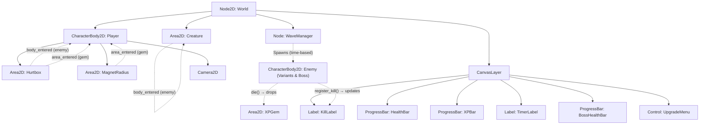

# 🎮 Tactical Tag-Team Survivor — Architecture & GDD

## 1. Project Philosophy & Core Vision
* **Core Loop:** Movement-based horde survival + creature-collection + tag-team roster management.
* **Design Mantra:** "Great artists steal." Fusing the dopamine of horde survivors, the team-building of creature catchers, and satisfying kinetic physics.
* **Development Philosophy:** Small scope, uncompromising polish. "Juice It or Lose It" — mechanics must feel incredible before expanding content.
* **Technical Architecture:** Decoupled, OOP design. Resource-driven data layers. No feature creep, no spaghetti code.

---

## 2. Core Mechanics

### The Player (The Anchor)
* **Control:** 8-way directional movement only (WASD/Arrows). No active attack button.
* **Attributes:** Health, Movement Speed, Magnet Radius (loot), Core Hurtbox.
* **Fail State:** HP ≤ 0 → scene reloads. Enemies deal damage via kamikaze collisions.

### The Companions (The Roster)
* **Behavior:** Autonomous entities tethered to the player via elastic leash (`lerp`).
* **AI (Finite State Machine):**
  * `FOLLOW` — Lazily trails behind at a fixed distance.
  * `ATTACK` — Triggered when enemy enters Aggro Radius. Rockets at target, destroys it, returns to `FOLLOW`.
* **Tag-Team (Upcoming):** Roster of up to 6 creatures, deploy limit based on earned "Badges."
* **Entrance Effects (Upcoming):** Swapping creatures triggers an AoE (stun-quake, flamethrower, etc.) to encourage active cycling.
* **Synergies:** Conditional buffs between slots (e.g., empty slot empowers active creature).

### The Swarm (Enemies)
* **Behavior:** Mindless physics-based horde (`CharacterBody2D`). Clump and push while hunting the player.
* **Death:** Drops XP Gem → `queue_free()`.

### The Economy (Loot & Progression)
* **XP Gems:** Two-phase: **Magnetize** (outer sensor) → **Consume** (inner hurtbox).
* **Tactical Pause:** On level-up, `SceneTree` pauses. UI presents 3 randomized upgrades from a Resource pool.

---

## 3. Scene Hierarchy & Signal Flow



---

## 4. Directory Layout

```text
res://
├── assets/                     # Global art, shaders, sound templates
│   └── shaders/
│       └── hit_flash.gdshader  # Shader for damage flashes
├── data/                       # Game database resources
│   └── upgrades/               # UpgradeResource data files (.tres)
├── entities/                   # Characters & interactive actors
│   ├── player/
│   │   └── player.gd
│   ├── enemy/
│   │   ├── enemy.tscn          # Base Grunt enemy
│   │   ├── enemy.gd
│   │   ├── enemy_sprinter.tscn # Fast enemy
│   │   ├── enemy_tank.tscn     # High HP enemy
│   │   ├── enemy_splitter.tscn # Splits into splitlings
│   │   ├── enemy_splitling.tscn# Miniature split offspring
│   │   └── boss.tscn           # Massive Gym Leader encounter
│   └── creature/
│       ├── creature.tscn
│       └── creature.gd
├── items/                      # Collectibles & powerups
│   └── xp_gem/
│       ├── xp_gem.tscn
│       └── xp_gem.gd
├── scenes/                     # Maps & orchestration scenes
│   └── world/
│       ├── world.tscn          # Game arena and main UI
│       └── world.gd
├── scripts/                    # Shared resources & utility controllers
│   ├── upgrade_resource.gd     # Level-up upgrade resource class
│   ├── wave_manager.gd         # Wave orchestration & spawning
│   └── camera_shake.gd         # Camera2D trauma shake system
├── ui/                         # Reusable UI components
│   ├── upgrade_card.tscn       # Individual upgrade options
│   ├── upgrade_card.gd
│   ├── upgrade_menu.tscn       # Selection wrapper
│   ├── upgrade_menu.gd
│   ├── damage_number.tscn      # Floater text scene
│   └── damage_number.gd
├── project.godot
├── ARCHITECTURE.md
├── CHANGELOG.md
└── README.md
```

---

## 5. Codebase Overview (Current State)

| Script | Location | Responsibility |
|--------|----------|---------------|
| [world.gd](file:///home/deck/Game%20Dev/vs3/vs-3/scenes/world/world.gd) | `scenes/world/` | Orchestrates the primary game loop, calculates elapsed survival time, manages the BossHealthBar, and initializes Player dependencies. |
| [player.gd](file:///home/deck/Game%20Dev/vs3/vs-3/entities/player/player.gd) | `entities/player/` | Controls movement, HP management, level-up progression, upgrade implementation, and tracks the kill count. |
| [enemy.gd](file:///home/deck/Game%20Dev/vs3/vs-3/entities/enemy/enemy.gd) | `entities/enemy/` | Shared AI behavior script for all enemy archetypes. Handles hit flash effects, floating damage numbers, spawning child splitlings, and XP gem drops. |
| [creature.gd](file:///home/deck/Game%20Dev/vs3/vs-3/entities/creature/creature.gd) | `entities/creature/` | Companion entity following player and striking targets via a `FOLLOW` → `ATTACK` FSM. |
| [xp_gem.gd](file:///home/deck/Game%20Dev/vs3/vs-3/items/xp_gem/xp_gem.gd) | `items/xp_gem/` | Magnetic loot object that accelerates toward player and pops visually on collection. |
| [wave_manager.gd](file:///home/deck/Game%20Dev/vs3/vs-3/scripts/wave_manager.gd) | `scripts/wave_manager.gd` | Escalation director that manages game phases, introduces variant enemies, and triggers the boss event. |
| [camera_shake.gd](file:///home/deck/Game%20Dev/vs3/vs-3/scripts/camera_shake.gd) | `scripts/camera_shake.gd` | Trauma-based 2D camera shaking using a decaying noise offset. |

---

## 6. What's Built ✅

- [x] Player 8-way movement with `CharacterBody2D` + `move_and_slide()`
- [x] Camera2D with trauma-based screen shake attached to player
- [x] Elastic creature companion with Follow/Attack FSM
- [x] WaveManager-based escalation (dynamic enemy pools & speed scaling)
- [x] Five distinct enemy profiles (Grunt, Sprinter, Tank, Splitter, Splitling)
- [x] Climax Boss Encounter (Gym Leader) scene & health bar tracker
- [x] Health, XP, Kill Count, and Survival Timer UI elements
- [x] Level-up system with tactical pause and choice-based upgrades
- [x] Floating damage numbers & hit flash shader feedback on hit
- [x] XP gem magnetized pickup & pop collection effects
- [x] Feature-based directory structure
- [x] Verbose educational comments on all scripts
- [x] VS Code workspace integration (settings.json, tasks.json)

---

## 7. Development Roadmap 🚀

### Phase 2: Tag-Team Roster (NEXT)
- [ ] Refactor World/Player to hold `Array[PackedScene]` of creatures (the Roster)
- [ ] Input listener (keys 1-6) to swap active creature
- [ ] Entrance Effects on swap (temporary Area2D explosion/stun)
- [ ] Badge system — survive milestones to unlock more active slots

### Phase 4: Remaining Juice & Polish
- [ ] Squash-and-stretch on player movement changes
- [ ] Particle emitters for gem pickup and level-up
- [ ] Audio: xp-pickup pop, attack thud, level-up fanfare, ui-hover click

### Phase 5: Game State & Wrapping
- [ ] Game Over screen on death
- [ ] "Survived!" screen at 10-minute mark
- [ ] Main menu with background gameplay loop

