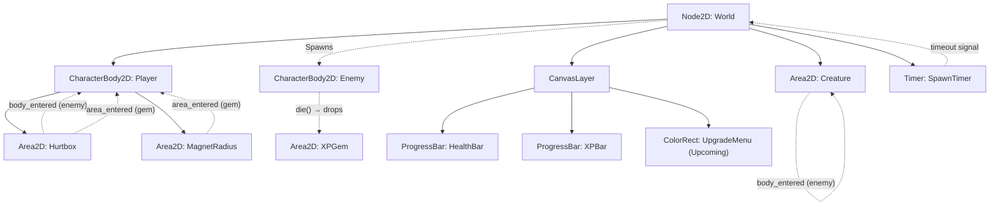

# 🎮 Tactical Tag-Team Survivor — Architecture & GDD

## 1. Project Philosophy & Core Vision
* **Core Loop:** Movement-based horde survival + creature-collection + tag-team roster management.
* **Design Mantra:** "Great artists steal." Fusing the dopamine of horde survivors, the team-building of creature catchers, and satisfying kinetic physics.
* **Development Philosophy:** Small scope, uncompromising polish. "Juice It or Lose It" — mechanics must feel incredible before expanding content.
* **Technical Architecture:** Decoupled, OOP design. Resource-driven data layers. No feature creep, no spaghetti code.

---

## 2. Core Mechanics

### The Player (The Anchor)
* **Control:** 8-way directional movement only (WASD/Arrows). No active attack button.
* **Attributes:** Health, Movement Speed, Magnet Radius (loot), Core Hurtbox.
* **Fail State:** HP ≤ 0 → scene reloads. Enemies deal damage via kamikaze collisions.

### The Companions (The Roster)
* **Behavior:** Autonomous entities tethered to the player via elastic leash (`lerp`).
* **AI (Finite State Machine):**
  * `FOLLOW` — Lazily trails behind at a fixed distance.
  * `ATTACK` — Triggered when enemy enters Aggro Radius. Rockets at target, destroys it, returns to `FOLLOW`.
* **Tag-Team (Upcoming):** Roster of up to 6 creatures, deploy limit based on earned "Badges."
* **Entrance Effects (Upcoming):** Swapping creatures triggers an AoE (stun-quake, flamethrower, etc.) to encourage active cycling.
* **Synergies:** Conditional buffs between slots (e.g., empty slot empowers active creature).

### The Swarm (Enemies)
* **Behavior:** Mindless physics-based horde (`CharacterBody2D`). Clump and push while hunting the player.
* **Death:** Drops XP Gem → `queue_free()`.

### The Economy (Loot & Progression)
* **XP Gems:** Two-phase: **Magnetize** (outer sensor) → **Consume** (inner hurtbox).
* **Tactical Pause:** On level-up, `SceneTree` pauses. UI presents 3 randomized upgrades from a Resource pool.

---

## 3. Scene Hierarchy & Signal Flow



---

## 4. Directory Layout

```text
res://
├── assets/                     # Global art, sounds, fonts
│   └── icon.svg
├── entities/                   # Characters & interactive actors
│   ├── player/
│   │   └── player.gd
│   ├── enemy/
│   │   ├── enemy.tscn
│   │   └── enemy.gd
│   └── creature/
│       ├── creature.tscn
│       └── creature.gd
├── items/                      # Collectibles & powerups
│   └── xp_gem/
│       ├── xp_gem.tscn
│       └── xp_gem.gd
├── scenes/                     # Maps & orchestration scenes
│   └── world/
│       ├── world.tscn
│       └── world.gd
├── scripts/                    # Shared resources & utilities (upcoming)
│   └── upgrade_resource.gd     # (Phase 1 target)
├── ui/                         # Reusable UI components (upcoming)
│   └── upgrade_card.tscn       # (Phase 1 target)
├── project.godot
├── ARCHITECTURE.md
├── CHANGELOG.md
└── README.md
```

---

## 5. Codebase Overview (Current State)

| Script | Location | Responsibility |
|--------|----------|---------------|
| [world.gd](file:///home/deck/Game%20Dev/vs3/vs-3/scenes/world/world.gd) | `scenes/world/` | Orchestrates initialization; spawns enemies on timer ring around player using `TAU` trigonometry |
| [player.gd](file:///home/deck/Game%20Dev/vs3/vs-3/entities/player/player.gd) | `entities/player/` | Movement, HP management, XP economy, two-phase gem collection (Magnet → Mouth) |
| [enemy.gd](file:///home/deck/Game%20Dev/vs3/vs-3/entities/enemy/enemy.gd) | `entities/enemy/` | Chase AI via `move_and_slide()`, drops XP gem on `die()` using `call_deferred` |
| [creature.gd](file:///home/deck/Game%20Dev/vs3/vs-3/entities/creature/creature.gd) | `entities/creature/` | Follow/Attack FSM with lerp movement, `is_instance_valid()` safety checks |
| [xp_gem.gd](file:///home/deck/Game%20Dev/vs3/vs-3/items/xp_gem/xp_gem.gd) | `items/xp_gem/` | Idle until magnetized, then accelerates via `move_toward()` |

---

## 6. What's Built ✅

- [x] Player 8-way movement with `CharacterBody2D` + `move_and_slide()`
- [x] Camera2D attached to player
- [x] Elastic creature companion with Follow/Attack FSM
- [x] Enemy spawner (Timer-based, radial off-screen spawn)
- [x] Enemy chase AI with physics clumping
- [x] Kamikaze damage system (enemy → player)
- [x] Health bar UI (CanvasLayer + ProgressBar)
- [x] XP gem drop on enemy death (preloaded scene, `call_deferred`)
- [x] Two-phase gem collection (Magnet radius → Hurtbox consumption)
- [x] XP bar UI with scaling level-up thresholds (1.5x multiplier)
- [x] Level-up detection with `print()` confirmation
- [x] Feature-based directory structure
- [x] Verbose educational comments on all scripts
- [x] VS Code workspace integration (settings.json, tasks.json)
- [x] Antigravity skill file for Godot conventions

---

## 7. Development Roadmap 🚀

### Phase 1: The Upgrade System (NEXT)
> **Goal:** When the player levels up, the game freezes, a styled menu appears with 3 random upgrade cards, picking one modifies stats.

- [ ] Create `scripts/upgrade_resource.gd` — custom `Resource` class with `UpgradeType` enum, title, description, icon, and value
- [ ] Create `ui/upgrade_card.tscn` — Button → VBoxContainer → TextureRect + Labels; emits `chosen` signal
- [ ] Create `UpgradeMenu` (ColorRect) inside CanvasLayer with `process_mode = ALWAYS` so it works while paused
- [ ] Wire `player.gd` → `level_up()` calls `upgrade_menu.open_menu()`
- [ ] Wire `upgrade_menu.upgrade_selected` signal → `player.gd` applies stat changes via `match` on `UpgradeType`
- [ ] Create at least 4 `.tres` upgrade resources: Speed Boost, Attack Speed, Heal, Max Health
- [ ] Drag `.tres` files into the UpgradeMenu's `upgrade_pool` array in the Inspector

### Phase 2: Tag-Team Roster
- [ ] Refactor World to hold `Array[PackedScene]` of creatures (the Roster)
- [ ] Input listener (keys 1-6) to swap active creature
- [ ] Entrance Effects on swap (temporary Area2D explosion/stun)
- [ ] Badge system — survive milestones to unlock more active slots

### Phase 3: Escalation Director
- [ ] Replace `SpawnTimer` with `WaveManager` node
- [ ] Wave data structures (Minute 1: basic, Minute 3: fast, Minute 5: tanky)
- [ ] Elite/Boss spawns at minute 10 mark

### Phase 4: Juice (High Polish)
> **Rule:** Freeze all feature development during this phase.
- [ ] Hit-flash shader (white flash 0.1s on enemy hit)
- [ ] Trauma-based camera shake on damage
- [ ] Damage number popups (Label + Tween: float up + fade out)
- [ ] Squash-and-stretch on player movement changes
- [ ] Particle emitters for gem pickup and level-up
- [ ] Audio: xp-pickup pop, attack thud, level-up fanfare, ui-hover click

### Phase 5: Game State & Wrapping
- [ ] Game Over screen on death
- [ ] "Survived!" screen at 10-minute mark
- [ ] Main menu with background gameplay loop
- [ ] Survival timer display HUD
