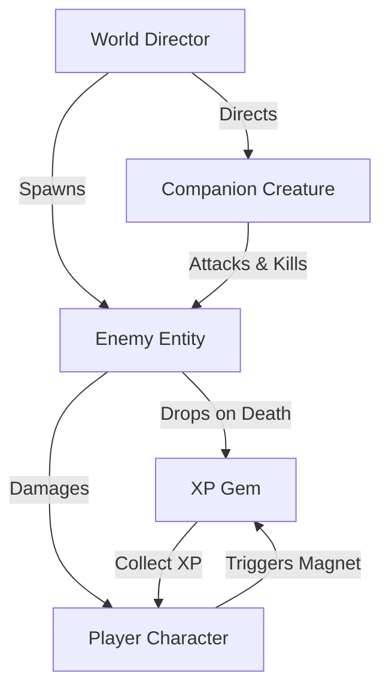
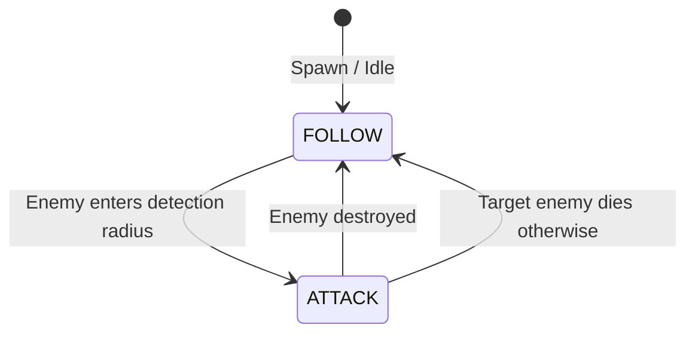

# VS3 - Top-Down Survivor-Like Prototype

Welcome to **VS3**, a 2D top-down "Survivor-like" game prototype built in **Godot Engine 4.6** (using **GL Compatibility** renderer and the **Jolt Physics** 3D engine configuration ready for extension). 

In this prototype, the player navigates an open arena, surviving waves of spawning enemies with the help of an automated companion creature. Defeated enemies drop XP gems that magnetize to the player to level up and increase the challenge.

---

## 🎮 Gameplay & Mechanics

1. **Player Movement & Control**:
   - The player is controlled via standard directional input (keyboard/arrow keys).
   - Tracks a main Health Bar and an XP Progress Bar.
   - Taking damage reloads the scene if health drops to `0`.
2. **Companion Creature (Companion AI)**:
   - Follows the player at a friendly distance.
   - Automatically detects nearby enemies and switches states to charge and destroy them.
3. **Enemy Waves**:
   - Spawn in a circle surrounding the player.
   - Chase the player node directly.
   - Drop XP Gems upon death.
4. **XP Gem Collection (Magnet Physics)**:
   - Gems are attracted dynamically to the player within a detection circle.
   - Once magnetized, they accelerate rapidly toward the player for a punchy, responsive feel.
   - Collecting gems levels up the player, which dynamically scales the difficulty threshold for subsequent levels.

---

## 🏗️ Architecture & Interaction Flow

The interaction between different game entities is managed dynamically through signals and script APIs. Below is a diagram illustrating the entity relationships:



### State Machine of the Companion Creature
The helper companion uses a clean finite state machine to swap behaviors:



---

## 📂 Codebase Tour

Below is the directory map with links directly to each module file:

### Configuration & Tooling
*   [project.godot](file:///home/deck/Game%20Dev/vs3/vs-3/project.godot) — Engine configurations, including autoloads, input, rendering, and physics setup.
*   [export_presets.cfg](file:///home/deck/Game%20Dev/vs3/vs-3/export_presets.cfg) — Presets for compiling to Linux, Windows, and Web.
*   [scripts/setup_godot.py](file:///home/deck/Game%20Dev/vs3/vs-3/scripts/setup_godot.py) — Automation script used by CI to fetch the Godot runtime.

### Characters & AI Entities
*   [entities/player/player.gd](file:///home/deck/Game%20Dev/vs3/vs-3/entities/player/player.gd) — Manages player inputs, stats, XP/level-up progression, and upgrade modifications.
*   [entities/player/weapons/](file:///home/deck/Game%20Dev/vs3/vs-3/entities/player/weapons/) — Contains weapon controllers and projectiles (Maglev Cube and Card Deck).
*   [scripts/companion_base.gd](file:///home/deck/Game%20Dev/vs3/vs-3/scripts/companion_base.gd) — Base class for all Pokémon companions; handles movement kinematics, squish/stretch, and automatic dynamic sprite loading.
*   [entities/creature/pokemon/](file:///home/deck/Game%20Dev/vs3/vs-3/entities/creature/pokemon/) — Contains individual Pokémon companion scenes and scripts (Pikachu, Zubat, Geodude, Staryu, Rattata, and their evolved forms).
*   [entities/enemy/enemy.gd](file:///home/deck/Game%20Dev/vs3/vs-3/entities/enemy/enemy.gd) — Chases the player, processes stats/scaling, takes damage (flashing red on bleed), and handles splitter/boss mechanics.

### Orchestration & Core Scripts
*   [scenes/world/world.gd](file:///home/deck/Game%20Dev/vs3/vs-3/scenes/world/world.gd) — World scene controller; updates timer labels, HUD, and coordinates boss defeat states.
*   [scripts/wave_manager.gd](file:///home/deck/Game%20Dev/vs3/vs-3/scripts/wave_manager.gd) — Directs wave difficulty progression, introduces sprinter/tank/splitter enemies, and instantiates the climax boss encounter.
*   [scripts/sound_manager.gd](file:///home/deck/Game%20Dev/vs3/vs-3/scripts/sound_manager.gd) — Autoload audio manager; loads and plays wav sound effects across a reusable stream player pool.

### UI & Overlay Screens
*   [ui/upgrade_menu.gd](file:///home/deck/Game%20Dev/vs3/vs-3/ui/upgrade_menu.gd) — Handles pause selection cards and houses the fullscreen tech tree.
*   [ui/tech_tree_panel.gd](file:///home/deck/Game%20Dev/vs3/vs-3/ui/tech_tree_panel.gd) — Dynamic, resizable upgrades progression tree visualizer.

---

## 🤝 Collaboration & Branch Workflow

To keep the project stable for collaborative vibe-coding and additions:

1. **`main` (Production Branch)**:
   - Locked. **Do not commit directly to `main`**.
   - Pushes/merges to `main` trigger a GitHub Actions pipeline that automatically exports the game to Web and updates the live site.
2. **`dev` (Integration Branch)**:
   - Staging baseline. All features and bugfixes must branch from `dev` and merge back into `dev`.
3. **Sandbox Feature Branches (`feat/*`, `fix/*`, `refactor/*`)**:
   - Create a branch for work:
     ```bash
     git checkout dev
     git pull origin dev
     git checkout -b feat/your-feature
     ```
   - Test your scripts locally before committing:
     ```bash
     /home/deck/Desktop/Godot_v4.6.3-stable_linux.x86_64 --headless --editor --quit
     ```
   - Commit, push, and open a merge request to merge `feat/your-feature` ──> `dev`.

---

## 🚀 Getting Started

### Prerequisites
- [Godot Engine 4.6 Stable](https://godotengine.org) or higher.

### Running the Project
1. Clone or download this repository.
2. Open the Godot Project Manager.
3. Click **Import**, navigate to the project directory, and select `project.godot`.
4. Press **F5** or click the **Play** button in the top-right corner to run the main scene.
