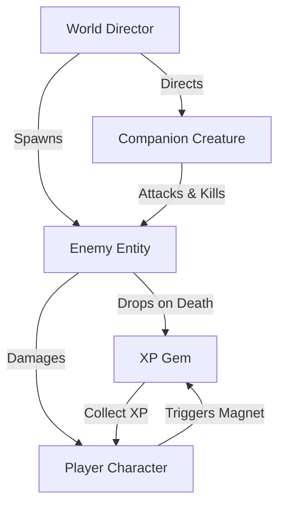
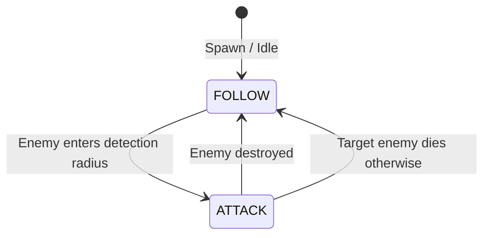

# VS3 - Top-Down Survivor-Like Prototype

Welcome to **VS3**, a 2D top-down "Survivor-like" game prototype built in **Godot Engine 4.6** (using **GL Compatibility** renderer and the **Jolt Physics** 3D engine configuration ready for extension). 

In this prototype, the player navigates an open arena, surviving waves of spawning enemies with the help of an automated companion creature. Defeated enemies drop XP gems that magnetize to the player to level up and increase the challenge.

---

## 🎮 Gameplay & Mechanics

1. **Player Movement & Control**:
   - The player is controlled via standard directional input (keyboard/arrow keys).
   - Tracks a main Health Bar and an XP Progress Bar.
   - Taking damage reloads the scene if health drops to `0`.
2. **Companion Creature (Companion AI)**:
   - Follows the player at a friendly distance.
   - Automatically detects nearby enemies and switches states to charge and destroy them.
3. **Enemy Waves**:
   - Spawn in a circle surrounding the player.
   - Chase the player node directly.
   - Drop XP Gems upon death.
4. **XP Gem Collection (Magnet Physics)**:
   - Gems are attracted dynamically to the player within a detection circle.
   - Once magnetized, they accelerate rapidly toward the player for a punchy, responsive feel.
   - Collecting gems levels up the player, which dynamically scales the difficulty threshold for subsequent levels.

---

## 🏗️ Architecture & Interaction Flow

The interaction between different game entities is managed dynamically through signals and script APIs. Below is a diagram illustrating the entity relationships:

### State Machine of the Companion Creature
The helper companion uses a clean finite state machine to swap behaviors:

---

## 📂 Codebase Tour

Below is the directory map with links directly to each module file and key functions:

### Configuration
*   [project.godot](file:///home/deck/Game%20Dev/vs3/vs-3/project.godot) — Engine configurations, including input, physics engine, and render details.

### Scripts
*   [player.gd](file:///home/deck/Game%20Dev/vs3/vs-3/player.gd) — Manages the player character.
    *   [SPEED](file:///home/deck/Game%20Dev/vs3/vs-3/player.gd#L3) - Current player movement speed constant.
    *   [_physics_process](file:///home/deck/Game%20Dev/vs3/vs-3/player.gd#L23) - Processes character movement and physics.
    *   [take_damage](file:///home/deck/Game%20Dev/vs3/vs-3/player.gd#L36) - Lowers player health and reloads on death.
    *   [gain_xp](file:///home/deck/Game%20Dev/vs3/vs-3/player.gd#L58) - Tracks progress, triggers level ups, and updates UI.
    *   [level_up](file:///home/deck/Game%20Dev/vs3/vs-3/player.gd#L68) - Increases difficulty threshold and levels up.
*   [creature.gd](file:///home/deck/Game%20Dev/vs3/vs-3/creature.gd) — Handles the helper companion's State Machine.
    *   [State](file:///home/deck/Game%20Dev/vs3/vs-3/creature.gd#L11) - Enum defining `FOLLOW` and `ATTACK` states.
    *   [_process](file:///home/deck/Game%20Dev/vs3/vs-3/creature.gd#L14) - Executes state behavior (interpolation/chase).
    *   [_on_body_entered](file:///home/deck/Game%20Dev/vs3/vs-3/creature.gd#L39) - Transitions state to `ATTACK` when an enemy enters detection range.
*   [enemy.gd](file:///home/deck/Game%20Dev/vs3/vs-3/enemy.gd) — Enemy behavior.
    *   [_physics_process](file:///home/deck/Game%20Dev/vs3/vs-3/enemy.gd#L10) - Chases player.
    *   [die](file:///home/deck/Game%20Dev/vs3/vs-3/enemy.gd#L18) - Spawns XP Gem and safely removes enemy from tree.
*   [xp_gem.gd](file:///home/deck/Game%20Dev/vs3/vs-3/xp_gem.gd) — XP Gem pickup physics.
    *   [magnetize_to](file:///home/deck/Game%20Dev/vs3/vs-3/xp_gem.gd#L25) - Starts the attraction phase toward a target node.
    *   [_process](file:///home/deck/Game%20Dev/vs3/vs-3/xp_gem.gd#L11) - Handles the exponential acceleration towards the collector.
*   [world.gd](file:///home/deck/Game%20Dev/vs3/vs-3/world.gd) — Spawn timing and scene director.
    *   [_on_spawn_timer_timeout](file:///home/deck/Game%20Dev/vs3/vs-3/world.gd#L15) - Spawns enemies on a radius circle surrounding the player.

### Scenes
*   [world.tscn](file:///home/deck/Game%20Dev/vs3/vs-3/world.tscn) — The primary game world scene featuring HUD UI elements, spawner nodes, player, and companion.
*   [creature.tscn](file:///home/deck/Game%20Dev/vs3/vs-3/creature.tscn) — The helper companion scene layout.
*   [enemy.tscn](file:///home/deck/Game%20Dev/vs3/vs-3/enemy.tscn) — The enemy scene with standard physics collisions.
*   [xp_gem.tscn](file:///home/deck/Game%20Dev/vs3/vs-3/xp_gem.tscn) — The collectable XP gem scene.

---

## 🚀 Getting Started

### Prerequisites
- [Godot Engine 4.6 Stable](https://godotengine.org) or higher.

### Running the Project
1. Clone or download this repository.
2. Open the Godot Project Manager.
3. Click **Import**, navigate to the project directory, and select `project.godot`.
4. Press **F5** or click the **Play** button in the top-right corner to run the main scene.
