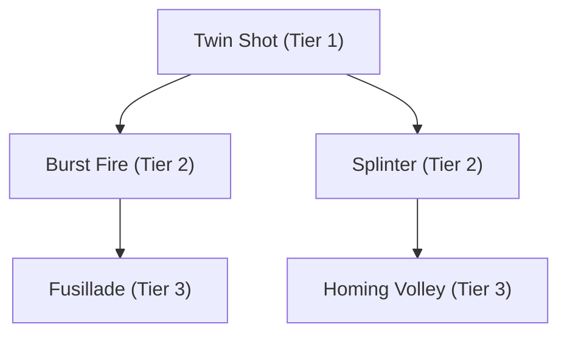
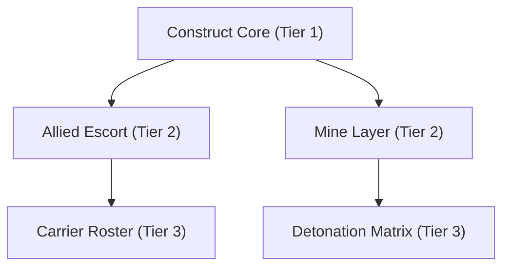
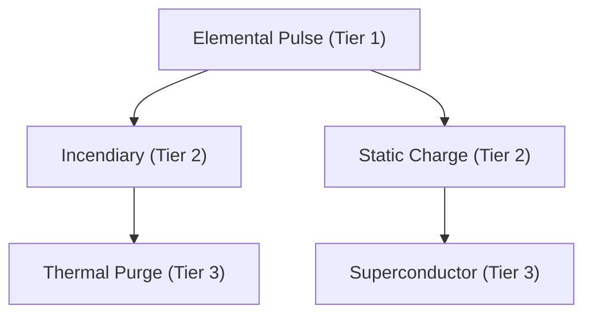
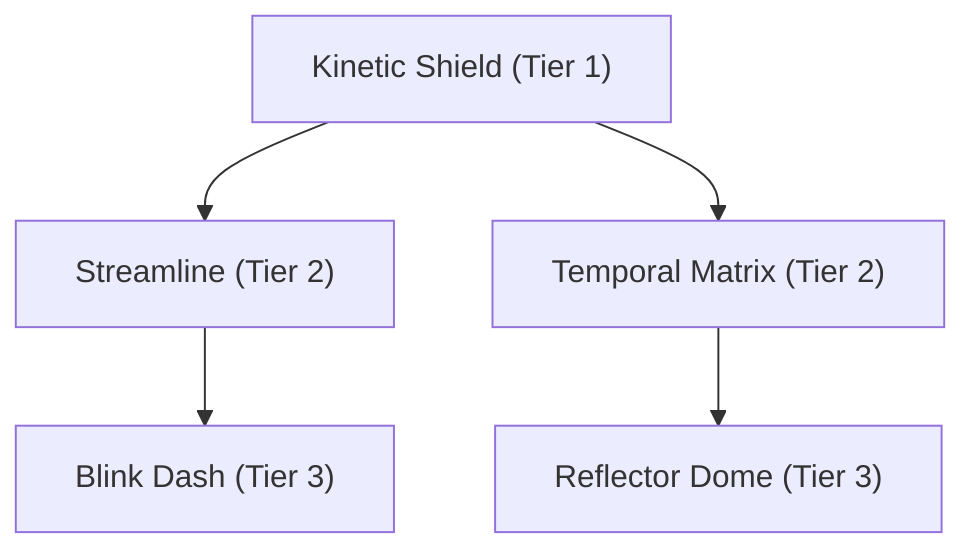

# 🌌 Nova Drift-Inspired Upgrade Trees (Ideas Reference)

This reference lists modular, synergistic upgrade trees directly inspired by the indie roguelike space shooter **Nova Drift**, adapted to fit the companion-swapping survival gameplay of `vs-3`. These are **ideas only for now**, serving as inspiration for you and Rishu.

---

## 1. Projectile & Weapon Modification Tree (The "Fusillade" Path)
Inspired by Nova Drift's weapon modifications, this tree focuses on modifying the behaviour, count, and physics of projectiles (applies to weapons like *Maglev Cube*, *Deck Cards*, and companion water/lightning projectiles).

### Upgrades:
*   **Twin Shot (Tier 1)**: Fires +1 projectile, but reduces individual projectile damage by 10%.
*   **Burst Fire (Tier 2)**: Projectiles are fired in rapid 3-shot bursts rather than a continuous stream.
*   **Splinter (Tier 2)**: On hitting an enemy, projectiles split/shatter into 3 smaller, low-damage shrapnel pieces flying in random directions.
*   **Fusillade (Tier 3)**: Fires a fan of +3 projectiles with increased spread, reducing individual damage by 20%.
*   **Homing Volley (Tier 3)**: Projectiles slowly curve toward the nearest enemy in their field of view.

---

## 2. Summoner & Construct Tree (The "Carrier" Path)
Inspired by Nova Drift's constructs, this path enhances companion summon dynamics, making companions act as motherships or active deployers of minor constructs.

### Upgrades:
*   **Construct Core (Tier 1)**: All companions gain +20% movement speed and deal +15% contact/punch/bite damage.
*   **Allied Escort (Tier 2)**: The active companion spawns a minor, floating "micro-drone" companion that shoots basic energy pulses at nearby targets.
*   **Mine Layer (Tier 2)**: The active companion drops a stationary energy mine behind them every 4 seconds. Mines explode on contact.
*   **Carrier Roster (Tier 3)**: The player can deploy 2 companions simultaneously instead of 1 (the active companion and the second companion in the roster). Companion swapping now cycles the main active companion.
*   **Detonation Matrix (Tier 3)**: Mines laid by the companion chain-explode, triggering smaller secondary explosions in a cluster.

---

## 3. Status Damage & Burn Tree (The "Incendiary" Path)
Inspired by Nova Drift's status effect combinations, this tree focuses on applying DOT (damage over time) and elemental synergies (fire, static electricity, and corrosion).

### Upgrades:
*   **Elemental Pulse (Tier 1)**: Weapon hits have a 15% chance to apply a random status effect (Burn, Shock, or Slow).
*   **Incendiary (Tier 2)**: Attacks apply a stack of *Burn*, dealing 5 damage per second over 3 seconds. Can stack up to 5 times.
*   **Static Charge (Tier 2)**: Attacks apply *Shock*. Shocked enemies release electric arcs to nearby enemies when taking damage from other sources.
*   **Thermal Purge (Tier 3)**: Hitting a fully-burned enemy triggers a fiery explosion, clearing the burn stacks but dealing massive AoE damage.
*   **Superconductor (Tier 3)**: Shock arcs chain to +3 additional enemies and have a 10% chance to briefly stun targets for 0.2 seconds.

---

## 4. Mobility & Shielding Tree (The "Blink" Path)
Inspired by Nova Drift's thruster and shield subsystems, this tree improves player defensive maneuvers and movement-based triggers.

### Upgrades:
*   **Kinetic Shield (Tier 1)**: Player gains a dynamic force shield that blocks 1 instance of damage. Regenerates every 12 seconds.
*   **Streamline (Tier 2)**: Increases player speed by 15% and increases acceleration/deceleration speed (highly responsive control).
*   **Temporal Matrix (Tier 2)**: Shield regeneration speed is doubled while companion swapping is on cooldown.
*   **Blink Dash (Tier 3)**: Pressing `Shift` (or controller trigger) teleports the player a short distance in the movement direction, granting 0.2 seconds of invulnerability.
*   **Reflector Dome (Tier 3)**: When the Kinetic Shield breaks, it deflects all incoming projectiles in a 360-degree circle back at the enemies.

---

## 5. Risk-Reward Wild Mods (The "Ataraxia" Path)
Inspired by Nova Drift's Wild Mods, these are high-impact upgrades that completely alter your build structure.

*   **Ataraxia (Horde Hoarder)**
    *   *Trade-off*: You gain +5% damage, +2% speed, and +5% pickup range for every unspent upgrade choice you hold.
    *   *Build Style*: Ideal for players who want to skip early upgrades to scale their base stats.
*   **Bravado (Gladiator)**
    *   *Trade-off*: Increases enemy spawn rates by 25% and boss HP by 30%, but increases all XP gains by 40% and adds +1 upgrade card choice to your level-up screens.
*   **Obsidius (Colossus)**
    *   *Trade-off*: You gain +150 Max HP and a permanent 15% damage reduction, but player movement speed is reduced by 30% and size is increased by 50% (larger hitbox).
*   **Chaos Engine (Unstable Swapper)**
    *   *Trade-off*: Companion swapping is locked to an automatic 5-second timer. Each swap triggers a massive random shockwave explosion, but you can no longer control when to cycle.
