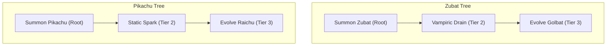

# 🌲 Proposed Tech Trees & Progression Restructure

This design document maps out the complete restructuring of the upgrade system to satisfy the three core design rules:
1. **Tree Enclosure**: All upgrade cards must belong to at least one tree.
2. **Prerequisite Gating**: Except for Tier 1 (Root) nodes, all upgrades can only appear after their parent prerequisite node is owned.
3. **Evolution Mimicry**: Pokémon companion trees are structured to reflect their evolution pathways (Base $\rightarrow$ Buff $\rightarrow$ Evolution).

---

## 1. Global Player Trees (Agility, Survivability, Firepower, Space)
These trees enhance the player's core attributes and global modifiers. They are structured in columns of 3 tiers.

### A. Agility Tree
*   **Tier 1 (Root)**: `speed_boost` (**Swift Wings**)
    *   *Effect*: +20% Player Speed.
*   **Tier 2**: `upgrade_global_velocity` (**Kinetic Boost**) — *Requires Swift Wings*
    *   *Effect*: +25% Global Projectile & Companion Velocity.
*   **Tier 3**: `blink_dash` (**Blink Dash**) — *Requires Kinetic Boost*
    *   *Effect*: Teleport a short distance in the movement direction with 0.2s invulnerability (on Shift/Trigger).

### B. Survivability Tree
*   **Tier 1 (Root)**: `max_health` (**Iron Constitution**)
    *   *Effect*: +25 Max Player HP (and heals for that amount).
*   **Tier 2**: `heal` (**Healing Pulse**) — *Requires Iron Constitution*
    *   *Effect*: Restores 30 HP instantly.
*   **Tier 3**: `phoenix_rebirth` (**Phoenix Rebirth**) — *Requires Healing Pulse*
    *   *Effect*: Instead of dying, restore 50% HP and clear nearby enemies. (Single use per run).

### C. Firepower Tree
*   **Tier 1 (Root)**: `upgrade_global_fire_rate` (**Overclock**)
    *   *Effect*: +35% Global Fire Rate.
*   **Tier 2**: `upgrade_global_projectiles` (**Split Core**) — *Requires Overclock*
    *   *Effect*: +1 to global projectiles.
*   **Tier 3**: `fusillade` (**Fusillade**) — *Requires Split Core*
    *   *Effect*: Weapon attacks shoot an extra fan of 2 projectiles at the cost of 10% damage.

### D. Space Tree
*   **Tier 1 (Root)**: `upgrade_global_aoe_radius` (**Nova Expansion**)
    *   *Effect*: +30% Global AoE Radius.
*   **Tier 2**: `attack_speed` (**Feral Instinct**) — *Requires Nova Expansion*
    *   *Effect*: Companion attacks 30% faster.
*   **Tier 3**: `singularity_pull` (**Gravity Well**) — *Requires Feral Instinct*
    *   *Effect*: Weapon explosions pull nearby enemies toward their center.

---

## 2. Pokémon Evolution Trees (5 Separate Trees)
Each Pokémon Companion has its own progressive evolution tree. 
*   *Note*: Since **Rattata** is the default starter companion, its root node (`Summon Rattata`) starts as **owned** at the beginning of the run.



### A. Rattata Tree (Starter)
*   **Tier 1 (Root)**: `unlock_rattata` (**Summon Rattata**)
    *   *Requirement*: Owned by default.
*   **Tier 2**: `buff_rattata` (**Fierce Fangs**) — *Requires Summon Rattata*
    *   *Effect*: +40% Rattata bite damage.
*   **Tier 3**: `evolve_raticate` (**Evolve Raticate**) — *Requires Fierce Fangs*
    *   *Effect*: Upgrades Rattata to Raticate (increases bite damage/size, and doubles XP collection radius).

### B. Zubat Tree
*   **Tier 1 (Root)**: `unlock_zubat` (**Summon Zubat**)
    *   *Requirement*: None (Available from Level 1).
    *   *Effect*: Unlocks Zubat (latches health-draining tethers onto nearby enemies).
*   **Tier 2**: `buff_zubat` (**Vampiric Drain**) — *Requires Summon Zubat*
    *   *Effect*: +40% Zubat lifesteal rate and damage.
*   **Tier 3**: `evolve_golbat` (**Evolve Golbat**) — *Requires Vampiric Drain*
    *   *Effect*: Upgrades Zubat to Golbat (adds +2 extra tethers, and allows drain to chain to nearby enemies).

### C. Staryu Tree
*   **Tier 1 (Root)**: `unlock_staryu` (**Summon Staryu**)
    *   *Requirement*: None (Available from Level 1).
    *   *Effect*: Unlocks Staryu (orbits tightly and fires water bullets).
*   **Tier 2**: `buff_staryu` (**Hydro Turbine**) — *Requires Summon Staryu*
    *   *Effect*: +40% Staryu water projectile damage.
*   **Tier 3**: `evolve_starmie` (**Evolve Starmie**) — *Requires Hydro Turbine*
    *   *Effect*: Upgrades Staryu to Starmie (orbits 40% wider and shoots sweeping cosmic lasers).

### D. Geodude Tree
*   **Tier 1 (Root)**: `unlock_geodude` (**Summon Geodude**)
    *   *Requirement*: None (Available from Level 1).
    *   *Effect*: Unlocks Geodude (heavy punches with domino knockback).
*   **Tier 2**: `buff_geodude` (**Tectonic Slam**) — *Requires Summon Geodude*
    *   *Effect*: +40% Geodude punching damage.
*   **Tier 3**: `evolve_graveler` (**Evolve Graveler**) — *Requires Tectonic Slam*
    *   *Effect*: Upgrades Geodude to Graveler (punches slow enemies by 40% and trigger mini-earthquakes).

### E. Pikachu Tree
*   **Tier 1 (Root)**: `unlock_pikachu` (**Summon Pikachu**)
    *   *Requirement*: None (Available from Level 1).
    *   *Effect*: Unlocks Pikachu (calls down lightning strikes).
*   **Tier 2**: `buff_pikachu` (**Static Spark**) — *Requires Summon Pikachu*
    *   *Effect*: +40% Pikachu lightning damage.
*   **Tier 3**: `evolve_raichu` (**Evolve Raichu**) — *Requires Static Spark*
    *   *Effect*: Upgrades Pikachu to Raichu (lightning chains to 3 adjacent targets and leaves static fire zones).

---

## 3. Availability & Gating Rules
To maintain the trees:
1.  **Owned List**: The player tracks owned upgrades (`owned_upgrades` array).
2.  **Tree Definition**: We define a unified prerequisite mapping in the code:
    ```gdscript
    const PREREQUISITES: Dictionary = {
        # Global Trees
        "upgrade_global_velocity": "speed_boost",
        "blink_dash": "upgrade_global_velocity",
        
        "heal": "max_health",
        "phoenix_rebirth": "heal",
        
        "upgrade_global_projectiles": "upgrade_global_fire_rate",
        "fusillade": "upgrade_global_projectiles",
        
        "attack_speed": "upgrade_global_aoe_radius",
        "singularity_pull": "attack_speed",
        
        # Pokemon Trees
        "buff_rattata": "unlock_rattata",
        "evolve_raticate": "buff_rattata",
        
        "buff_zubat": "unlock_zubat",
        "evolve_golbat": "buff_zubat",
        
        "buff_staryu": "unlock_staryu",
        "evolve_starmie": "buff_staryu",
        
        "buff_geodude": "unlock_geodude",
        "evolve_graveler": "buff_geodude",
        
        "buff_pikachu": "unlock_pikachu",
        "evolve_raichu": "buff_pikachu"
    }
    ```
3.  **Filtration Check**: During level-up, an upgrade is offered only if:
    *   It is not already owned.
    *   It has no prerequisite, OR its prerequisite is in `owned_upgrades`.
